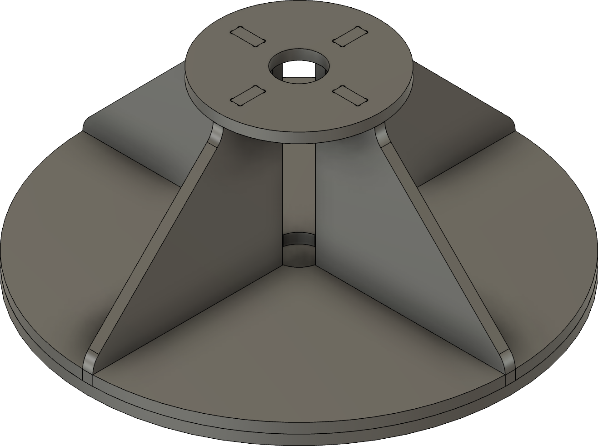

# Lysrør

Et open-source projekt til at skabe modulære LED-lysrør med 3D-printede komponenter og specialdesignet elektronik.

## Oversigt

LightTubes er et gør-det-selv projekt, der giver dig mulighed for at bygge tilpassede LED-lysrør. Systemet består af 3D-printbare dele og specialdesignet elektronik, hvilket gør det nemt at skabe dine egne professionelt udseende lysarmaturer.

## Komponenter

### Stativ Filer

Stativet er designet til at blive fræset i 12mm krydsfiner ved hjælp af en CNC-maskine med en bit-størrelse mindre end eller lig med 5mm. Følgende filer er tilgængelige i både DXF- og SVG-format:

| Filnavn | Beskrivelse | Links |
|----------|-------------|-------|
| Holder_Arm_4stk | Arme til stativet (4 styk påkrævet) | [DXF](Stand/Holder_Arm_4stk.dxf), [SVG](Stand/Holder_Arm_4stk.svg) |
| Holder_Bundplade | Bundplade til stativet | [DXF](Stand/Holder_Bundplade.dxf), [SVG](Stand/Holder_Bundplade.svg) |
| Holder_TopPlade | Topplade til stativet | [DXF](Stand/Holder_TopPlade.dxf), [SVG](Stand/Holder_TopPlade.svg) |
| Holder_Trekant_4stk | Trekantede støtter (4 styk påkrævet) | [DXF](Stand/Holder_Trekant_4stk.dxf), [SVG](Stand/Holder_Trekant_4stk.svg) |

#### Fræsekrav
- Materiale: 12mm krydsfiner
- CNC bit-størrelse: <= 5mm
- Filer er tilgængelige i både DXF-format (til CAM-software) og SVG-format (til forhåndsvisning og alternative arbejdsgange)

### 3D-Printede Dele

| Filnavn | Beskrivelse |
|----------|-------------|
| Dowel.3mf | Støttedowel til intern struktur |
| Electronics_V1.3mf | Kabinet til elektroniske komponenter |
| LED_Fixture_Narrow_V1.3mf | Smal variant af LED-monteringsbeslag |
| LED_Fixture_Wide_V1.3mf | Bred variant af LED-monteringsbeslag |
| Top_Part1_V1.3mf | Øverste sektion komponent 1 |
| Top_Part2_V1.3mf | Øverste sektion komponent 2 |
| TopCap_V1.3mf | Hætte til toppen af lysrøret |
| Tube_Part1_V1.3mf | Hovedrør sektion 1 |
| Tube_Part2_V1.3mf | Hovedrør sektion 2 |
| TwistHandle_V1.3mf | Drejemekanisme til montering/afmontering |

### Elektronik

#### Diagrammer
Det elektriske diagram for LightTubes er tilgængeligt i følgende formater:
- [PDF Format](Schematics/Schematic.pdf)
- [KiCad Projekt](Schematics/Schematics.kicad_sch)

#### Stykliste (BOM)
*TODO: Komplet stykliste med komponenter og mængder kommer snart*

## Opsætning

Vejledning til samling og opsætning kommer snart.

## Anvendelse

Brugsanvisning og eksempler kommer snart.

## Licens

Se [LICENSE](LICENSE) filen for detaljer.
